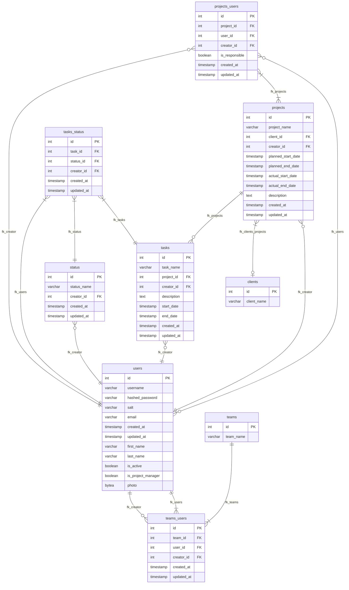

```mermaid
erDiagram
users {
    int id PK
    varchar username
    varchar hashed_password
    varchar salt
    varchar email
    timestamp created_at
    timestamp updated_at
    varchar first_name
    varchar last_name
    boolean is_active
    boolean is_project_manager
    bytea photo
}
teams {
    int id PK
    varchar team_name
}
teams_users {
    int id PK
    int team_id FK
    int user_id FK
    int creator_id FK
    timestamp created_at
    timestamp updated_at
}
teams_users }o--|| users : fk_creator
teams ||--|{ teams_users : fk_teams
users ||--|{ teams_users : fk_users

clients {
    int id PK
    varchar client_name
}

projects {
    int id PK
    varchar project_name
    int client_id FK
    int creator_id FK
    timestamp planned_start_date
    timestamp planned_end_date
    timestamp actual_start_date
    timestamp actual_end_date
    text description
    timestamp created_at
    timestamp updated_at
}
projects }o--|| users : fk_creator

projects_users {
    int id PK
    int project_id FK
    int user_id FK
    int creator_id FK
    boolean is_responsible
    timestamp created_at
    timestamp updated_at
}
projects }|--o| clients : fk_clients_projects
projects_users }o--o{ users : fk_users
projects_users }|--|{ projects : fk_projects

projects_users }o--|| users : fk_creator

tasks {
    int id PK
    varchar task_name
    int project_id FK
    int creator_id FK
    text description
    timestamp start_date
    timestamp end_date
    timestamp created_at
    timestamp updated_at
}
tasks }o--|| users : fk_creator

projects ||--o{ tasks : fk_projects

status {
    int id PK
    varchar status_name
    int creator_id FK
    timestamp created_at
    timestamp updated_at
}
status }o--|| users : fk_creator

tasks_status {
    int id PK
    int task_id FK
    int status_id FK
    int creator_id FK
    timestamp created_at
    timestamp updated_at
}
tasks_status }|--|| tasks : fk_tasks
tasks_status }|--|| status : fk_status
tasks_status }|--|| users : fk_users
```
